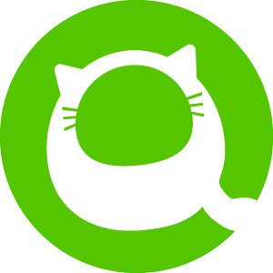

---
/home/fuji/profile:
  boot: README.md
  markdown_renderer_fallback                                                                                                                                        : !ruby/class "Fuji::ProfileRecovered"
  editor: /usr/bin/nvim
  stack: [go, rust, nix, cloud]
  recover: github.com/anton-fuji
---

  <code>website:</code> <a href="https://fuuji.site/"><code>fuuji.site ↗</code></a>

&nbsp;&nbsp;

 

cat ~/links.txt

 

    
    

 

tail -n 11 ~/writing.log

 

<!--[START POSTS]-->
-  [Vim風ショートカットをちょっと足した](https://fuji-blog.netlify.app/posts/vimmer-friendly-blog-shortcuts/)
-  [Goを開発プラットフォームとして見る](https://fuji-blog.netlify.app/posts/go-for-ai-assisted-development/)
-  [Neovimのタスク実行をOverseerとTelescopeでちょっと便利にした](https://fuji-blog.netlify.app/posts/neovim-overseer-telescope/)
-  [.dockerignoreを生成する「dibo」について紹介](https://zenn.dev/fuuji/articles/3b355c4252a4fc)
-  [GoでUNIXコマンドを作りながら、I/O処理を理解する](https://zenn.dev/fuuji/articles/6b2afad9252676)
-  [ソケット通信を一緒に理解しよう！！](https://qiita.com/fujifuji1414/items/6daa393a86582d81f0b5)
-  [TerraformでAmplifyを構築し、爆速でデプロイする](https://zenn.dev/fuuji/articles/795a7b6c9e4050)
-  [Fiber + Redis で URL Shortenerを実装し、仕組みを理解する](https://zenn.dev/fuuji/articles/5e148160d40698)
-  [サクッとGoで AI エージェントを構築してみる](https://qiita.com/fujifuji1414/items/fc259d51de4aaf1bc75e)
-  [TypeScriptのコンパイラをGoに移植｜10倍高速になった tsgo とは](https://qiita.com/fujifuji1414/items/98ddf083995f4e03ff32)
-  [ブラウザでWebサイトが表示されるまでの仕組みを整理してみた](https://qiita.com/fujifuji1414/items/f9c53b451fa4890b8bfc)
<!--[END POSTS]-->

 

stack/

 

<table>
<tr>
<td width="50%" valign="top">
  01 — BUILD 
  <strong>Services &amp; systems</strong> 
  APIs, CLIs, persistence, and performance-sensitive code.  
  
</td>
<td width="50%" valign="top">
  02 — PLATFORM 
  <strong>Cloud &amp; delivery</strong> 
  GCP-first infrastructure, automation, and reliable releases.  
  
</td>
</tr>
<tr>
<td valign="top">
  03 — TOOLCHAIN 
  <strong>Developer environment</strong> 
  Neovim workflow and reproducible local environments.  
  
</td>
<td valign="top">
  04 — INTERFACE 
  <strong>Useful surfaces</strong> 
  Focused UIs when a tool needs a human-facing layer.  
  
</td>
</tr>
</table>

 

ls ~/certs

 

<table>
<tr>
<td align="center"> Cloud Digital Leader</td>
<td align="center"> Associate Cloud Engineer</td>
<td align="center"> Cloud Developer</td>
<td align="center"> Cloud Architect</td>
<td align="center"> Cloud DevOps Engineer</td>
<td align="center"> Data Engineer</td>
</tr>
</table>

 

cat ~/activity

 

<table>
<tr>
<td align="center" width="50%">
  
</td>
<td align="center" width="50%">
  
</td>
</tr>
</table>

